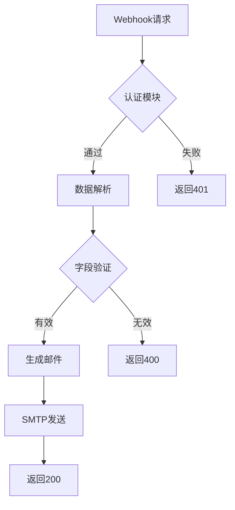

# Webhook事件通知系统


一个基于Flask的Webhook接收处理系统，提供安全认证（其实是最简单的header字段验证）、数据解析和HTML邮件通知功能。

## 功能特性

- 🔒 多层次安全验证
  - Bearer Token身份认证
  - 请求头校验
  - 必填字段验证
- 📬 智能邮件通知
  - HTML报告模板
  - 自动时间戳记录
  - SMTP加密传输
    
## 快速开始

### 前置要求

- Python 3.8+
- SMTP服务账号

### 安装部署

```bash
# 克隆仓库
git clone https://github.com/8423ffsf/webhook_mailsend.git
cd webhook_mailsend

# 安装依赖
pip install -r requirements.txt
```

### 配置说明

编辑`.env`文件（必改）：

```.env
# 认证配置
WEBHOOK_TOKEN=your_secure_token_here
AUTH_SCHEME=Bearer

# 邮件服务
SMTP_SERVER=smtp.example.com
SMTP_PORT=465
SMTP_USER=your_email@domain.com
SMTP_PASSWORD=your_email_password
EMAIL_FROM=notifications@yourdomain.com
EMAIL_TO=alerts@yourdomain.com

# 字段配置
REQUIRED_FIELDS=event_type,data.user_id
```

编辑`app.py`文件(可选)：

```python
#line47~50
send_html_email(
            subject=f"Webhook Alert - {report_time}", #修改subject的值以改变邮件通知的标题
            content=email_content
        )
```

编辑`templates/report.html`(可选)：

```html
#line110
<h1>
    <span>Webhook通知（菜单标题）</span>
    <span class="badge">{{ event_type }}</span>
</h1>

#line118~121
<tr>
    <th style="width: 30%;">字段（左表头）</th>
    <th>值（右表头）</th>
</tr>

#line145~148(页脚文字)
<div class="footer">
    <p>此邮件由系统自动发送，请勿直接回复（以下均为页脚文字）</p>
    <p>© 2023 Your Company Name. All Rights Reserved.</p>
</div>


```

### 启动服务

```bash
python app.py
```

默认监听端口：`5000`
在`app.py`中修改`host`段来改变监听地址，修改`port`段来改变监听地址
```python
#line104
app.run(host='0.0.0.0', port=5000)
```

## API文档

### 注意！！数据格式必须是json格式，且只接受post。

### 接收Webhook

**请求头**  
```http
Authorization: Bearer <your_token>
Content-Type: application/json
```

**请求示例**  
```bash
curl -X POST http://localhost:5000/webhook \
  -H "Authorization: Bearer your_token" \
  -H "Content-Type: application/json" \
  -d '{
    "event_type": "payment_success",
    "data": {
        "user_id": "UA-20230721-001"
    }
  }'
```

**成功响应**  
```json
{
  "status": "success",
  "received_at": "2023-07-21 14:30:45"
}
```

**错误代码**  
| 代码 | 说明               |
|------|--------------------|
| 401  | 身份验证失败       |
| 400  | 请求数据格式错误   |
| 500  | 服务器内部错误     |

## 高级配置

### 自定义模板

1. 修改`templates/report.html`
2. 调整样式变量：
```html
#line_8~104
:root {
  --primary-color: #1a73e8; /* 主色调 */
  --text-dark: #2d3748;     /* 正文颜色 */
  --border-color: #e2e8f0;  /* 边框颜色 */
}
```

### 性能调优

在`.env`中添加：
```ini
# 模板缓存
TEMPLATE_CACHE_SIZE=500
TEMPLATE_AUTO_RELOAD=False

# 连接池配置
SMTP_CONNECTION_POOL_SIZE=5
```

## 邮件示例


## 开发者指南

### 测试方案
```bash
# 单元测试
pytest tests/

# 集成测试
python -m tests.integration_test
```


**行为流程**  

